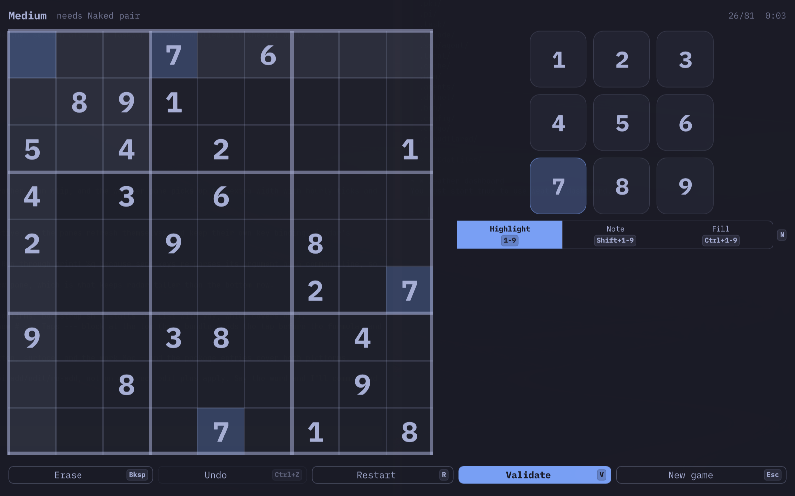
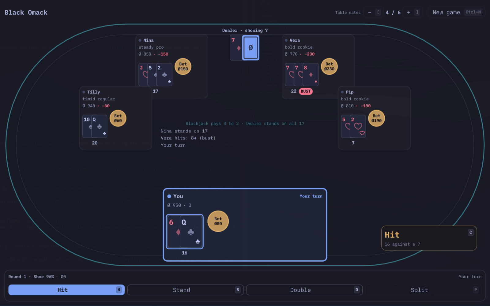

# Omagames

[](https://github.com/MZAWeb/omagames/actions/workflows/ci.yml)

Small, polished games for [Omarchy](https://omarchy.org), built with Qt Quick
and C++ in the spirit of `omawrite` and `omacalc`: dead simple, keyboard first,
and automatically following the Omarchy theme, system dark/light mode and text
size.

| Game | Directory | What |
|---|---|---|
| **Omadoku** | `games/omadoku` | Sudoku with four technique-graded levels, notes, digit highlighting and validate-as-you-go |
| **Black Omack** | `games/blackomack` | Casino blackjack with a persistent Omabucks bankroll and AI table mates |

Each game has its own README with rules and keyboard shortcuts.

| Omadoku | Black Omack |
|---|---|
|  |  |

This is a monorepo: games live under `games/`, everything shared (theming,
fonts, app bootstrap, common QML controls) lives under `common/` and is compiled
into each game. Each game ships as its own Arch package.

## Install

One line per game, on Omarchy (or any Arch):

```sh
curl -fsSL https://raw.githubusercontent.com/MZAWeb/omagames/main/install.sh | bash -s omadoku
curl -fsSL https://raw.githubusercontent.com/MZAWeb/omagames/main/install.sh | bash -s blackomack
```

It builds a real Arch package with `makepkg` and installs it with `pacman`, so
`sudo pacman -R omadoku` removes it cleanly. Pass several games at once to
install them together.

## Build & run

```sh
bin/build            # build every game -> build/games/<game>/<game>
bin/build omadoku    # build one game
bin/run omadoku      # build + launch
bin/test             # run every QtTest suite headlessly (bin/test omadoku or bin/test common for one)
bin/install omadoku  # build + makepkg -fsi the Arch package
```

Requirements: Qt 6 (`qt6-base`, `qt6-declarative`), `xdg-desktop-portal` and a
portal backend for live dark-mode / text-scale updates.

Pass `--theme-file path/to/colors.toml` to any game to preview it in another
Omarchy theme.

## Layout

```
common/        shared C++ (OmarchyTheme, SystemTheme, OmaGames::setupApplication), QML module `OmaGames`, fonts, tests/
games/<name>/  <name>.pro, src/ (engine + QML), tests/, pkgbuild/, README.md
docs/          ARCHITECTURE.md, NEW-GAME.md, PARALLEL-AGENTS.md, RELEASING.md
bin/           build / run / test / install / opr-pkgbuilds / release
install.sh     the one-line installer above
packaging/     OPR (omarchy-pkgs) directories generated at release time
screenshots/   images used by this README
```

## Contributing

- `docs/ARCHITECTURE.md` — how a game is structured and why.
- `docs/NEW-GAME.md` — step-by-step guide to add a game.
- `CLAUDE.md` — the rules every change must follow (humans and agents alike).
- `docs/PARALLEL-AGENTS.md` — running several coding agents at once with git worktrees.
- `docs/RELEASING.md` — cutting a release and publishing to the Omarchy Package Repository.

The iA Writer Mono font is bundled under the SIL Open Font License 1.1; see
`common/fonts/OFL.txt`. MIT licensed, see `LICENSE`.
